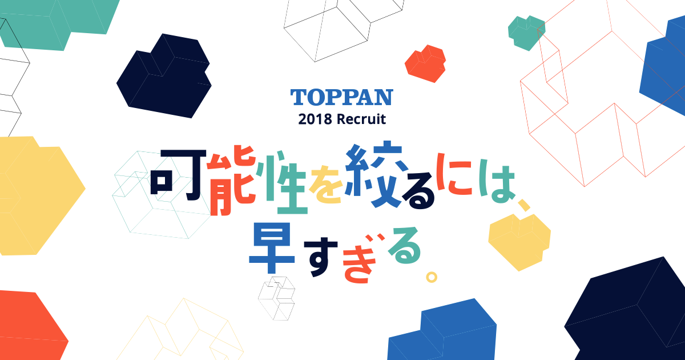

# toppanprinting_recruit_2018 README

https://ryosuketter.github.io/port_toppanprinting_recruit_2018/dest/recruit/shinsotsu/index.html

## 期間

2017-02-01 〜 2017-03-30

## 開発環境など

- [pug](https://pugjs.org/api/getting-started.html) -> HTML
- sass -> CSS
    - css設計: [Enduring CSS](http://ecss.io/)
- JavaScript(~ES5)
    - Library:jQuery
- build system:gulp
- Responsive Web Design

## Enduring CSSを採用した理由
- 共通コンポートが少ない
- 修正したときのスタイルの影響範囲が明確なので、運用しやすい

## 対応ブラウザ
PC
- IE = 11以上
- firefox, Safari, Chrome = 最新版

SP
- iOS = 8以上
- Android(chrome & firefox)